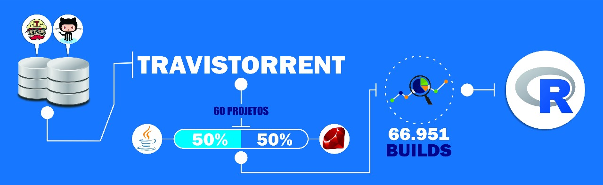

<style type="text/css"> 
.caption {    text-align: center; padding-bottom: 40px;}
</style>


```{r setup, include=FALSE}
knitr::opts_chunk$set(echo = FALSE)
library(dplyr, warn.conflicts = FALSE)
library(knitr, warn.conflicts = FALSE)
library(pander, warn.conflicts = FALSE)
library(tidyr, warn.conflicts = FALSE)
library(gmodels, warn.conflicts = FALSE)
library(ggplot2, warn.conflicts = FALSE)
library(png, warn.conflicts = FALSE)
library(lubridate, warn.conflicts = FALSE)
library(bursts, warn.conflicts = FALSE)
library(DescTools, warn.conflicts = FALSE)
```

```{r, message=FALSE, }
#Importatando bibliotecas
library(dplyr)
library(knitr)
library(tidyr)
library(pander)
library(gmodels)
library(ggplot2)
library(png)
library(lubridate)
library(bursts)
library(DescTools)
```

### **Introdução**

<p align="justify">A Integração Contínua (CI) é a prática de engenharia de software em que os desenvolvedores integram seu código em uma linha principal compartilhada com frequência, e verificam a qualidade de suas contribuições continuamente (BELLER, et al.,2017). De acordo com VASILESCU, et al.(2014), a CI é suportada por servidores de *build* (*e.g.**TravisTorrent*) que verificam cada integração automaticamente, executando testes de unidade e relatando os resultados de volta para os desenvolvedores. As *builds* do Travis CI apresentam os status *“passed”*, *“errored”*, *“failed”*, *“started”*, ou *“cancelled”* (MUYLAERT e DE ROOVER, 2017). RAUSCH et al (2017) afirmam que a CI melhorou os aspectos do processo de desenvolvimento de software, no entanto as *builds* com falhas representam uma ameaça para a eficiência do desenvolvimento, uma vez que ISLAM e ZIBRAN (2017), relatam que essas falhas impedem o trabalho dos desenvolvedores e atrasam o progresso do projeto.</p>

<p align="justify">De acordo com ISLAM e ZIBRAN (2017), os fatores que causam essas falhas devem ser identificados, pois com a identificação dos fatores os desenvolvedores podem tomar medidas cautelosas para minimizar seus impactos e, portanto, reduzir substancialmente o tempo de desenvolvimento. Após realizar um estudo da arte, foram identificados somente dois trabalhos que analisam os motivos de falhas na *build*: RAUSCH et al (2017) apresenta um estudo empírico das falhas de *build* em 14 projetos baseados em Java, e ISLAM e ZIBRAN (2017), examinam quantitativamente fatores de desenvolvimento que causam falhas de *builds* em projetos Java e Ruby. Identificamos assim uma lacuna no conhecimento sobre o que ocasiona as falhas na *build*. Dessa forma, acreditamos que esta pesquisa é importante para realizar um levantamento de novos fatores. Para isso, neste estudo investigamos três questões de pesquisa: Qp1. Projetos com maior quantidade de contribuintes tendem a ter mais falhas na *build*? QP2.O tipo de linguagem de programação influencia na geração de *build*  com falhas? QP3.Rajada de mudança está mais propensas a gerar *builds* com falhas?</p>

### **Metodologia**

<p align="justify">Esta seção apresenta a metodologia que foi utilizada para responder às questões de pesquisa, onde foram analisados 60 projetos que usam *Travis CI* e *GitHub*, combinando ambas as fontes de dados no *TravisTorrent*. Dos projetos analisados, 30 foram desenvolvidos em linguagem Java e 30 em linguagem Ruby, totalizando 66.951 *builds*. O tratamento e análise dos dados foram realizados através da linguagem R, conforme pode ser observado na Figura 1.</p>


```{r}
# carregando bases de dados
travis <- readRDS('travis-sample.rds')
commits <- readRDS('commits-sample.rds')

```
<p align="justify">O conjunto de dados do *TravisTorrent* permitiu extrair informações sobre os projetos, status das *builds*, ids de  *commits* relacionados a cada *build* e a linguagem de programação. Para obter o número de programadores, foi utilizado o *dataset* do *GitHub*, que contém o id dos *commits* e e-mails dos desenvolvedores.</p>

##### QP1: Projetos com maior quantidade de contribuintes tendem a ter mais falhas na *build*?

<p align="justify">SEO et al. (2014), relata que as dependências entre os membros da equipe podem ser aumentadas quando os tamanhos da equipe e do projeto são grandes, e essas dependências são suscetíveis a buids com falhas. Dessa forma, buscamos investigar se o tamanho da equipe está relacionado com a quantidade de falhas das *builds*. Logo, foram confrontadas duas hipóteses sobre as variáveis (tamanho da equipe e falhas da *build*), sendo H0 - Tamanho da equipe não está relacionado com as falhas na *build*, e H1 - O tamanho da equipe influencia na falha da *build*.</p>

##### QP2: O tipo de linguagem de programação influencia na geração de *build* com falhas?

<p align="justify">No *dataset* estudado, existem duas linguagens de programação, uma fortemente tipada (Java) e outra fracamente tipada (Ruby). Com essa questão (QP2), queremos saber se de fato a linguagem de programação influência na falha de *build*. Para isso, foram confrontadas duas hipóteses sobre as variáveis (linguagem de programação e falhas da *build*), sendo H0 - A linguagem de programação não está relacionada com as falhas na *build*, e H1 - A linguagem de programação influencia na falha da *build*.</p>

<p align="justify">Para todas as questões de pesquisa, foram utilizadas as informações das bases de dados *TravisTorrent* e *GitHub*. Essas bases possuem estruturas distintas, pois a base do *GitHub* apresenta um id de *commit* por linha e a base do *TravisTorrent* apresenta para cada *build* uma string, que contém os ids de *commits* separados por um caractere especial. Dessa forma, para agruparmos as duas bases para ser utilizada na QP1 e QP2, realizamos as seguintes etapas:</p>

<p align="justify"> - A variável *(git_all_built_commits)* foi transformada em uma lista, onde cada elemento desta lista possui um id de *commit* único.</p>
 
<p align="justify"> - Para cada elemento da lista, foi criada uma linha independente contendo o id do *commit*.</p>
```{r}
# Relaciona cada build job com os commits correspondentes
travis_commits <- travis %>%
  select(tr_job_id, git_all_built_commits) %>%
  mutate(git_commit_id = strsplit(git_all_built_commits, "#"))  %>%
  unnest(git_commit_id) %>%
  select(tr_job_id, git_commit_id)

```

<p align="justify"> - O id do *commit* e o nome do projeto foram usados como chave de combinação entre os *datasets*.</p>
```{r}
# Cria data frame em que cada linha representa um par (job, commit)
Job_commit <-travis %>%
  inner_join(travis_commits, by = c("tr_job_id")) %>%
  inner_join(commits, by = c("git_commit_id", "gh_project_name"))
```

<p align="justify">- O *dataset* gerado a partir desta combinação foi agrupado por projeto *(gh_project_name)*. Foi calculado o número de autores a partir dos emails distintos armazenados na variavel *(author_email)* no *dataset* do *GitHub*.</p>
```{r}
# autores por projeto
autores_por_projeto <- Job_commit %>%
  group_by(gh_project_name) %>%
  summarise(n_autores = n_distinct(author_email))
```
<p align="justify">- No *dataset* do *TravisTorrent* foi criada uma variável lógica, onde o *"passed"* recebeu o valor *true* e os demais foram classificados como *false*. Essa classificação foi baseada em SOUZA e SILVA (2017), onde foi classificadosucesso se seu status for "passed", e quebra de *builds* se seu status for *“errored”*, *“failed”*,  ou *“cancelled”*.</p>
```{r}
# Status da build como vetor logico
travis <- travis %>%  mutate(status_logic = if_else(tr_status == 'passed', TRUE, FALSE) )
```
<p align="justify">- O *dataset* do *TravisTorrent* foi agrupado por *build*, contendo o status lógico *(status_logic)*,a linguagem utilizada e o nome do projeto.</p> 
```{r}
# Agrupando por build
status_por_build <- travis %>% 
                        group_by(tr_build_id) %>% 
                            summarise(  # tratando variavel status da build como vetor logico
                                        status_logic = unique(status_logic),
                                        gh_lang = unique(gh_lang),
                                        gh_project_name = unique(unique(gh_project_name))
                                      )
```
<p align="justify">- Na sequência, os dados foram agrupados por projetos incluindo a linguagem, o número total de *builds*, o número de *builds* classificadas como *true* e a proporção de sucesso nessas *builds*.</p>
```{r}
 #Agrupando por projeto
status_por_proj <- status_por_build %>% 
                        group_by(gh_project_name) %>% 
                                                summarise(   gh_lang = unique(gh_lang),
                                                             # Numero total de builds
                                                             total_build     = n(),
                                                             # numero de builds que passaram
                                                             total_passou = sum(status_logic),
                                                             # propor??o de sucesso e fracasso das builds
                                                             status_prop = total_passou/total_build
                                                          )
```
<p align="justify">- Foi feita uma combinação do número de autores e *status* por projeto.</p>
```{r}
 # numero de autores e status da build agrupados por projeto
status.n_autores <- inner_join(autores_por_projeto, status_por_proj, by = "gh_project_name")
```
<p align="justify"> - Foi criada uma variável ordinal *(n_autores_ordinal)* para armazenar o número de autores, onde os projetos foram classificados em 4 categorias (P,M,G,GG) de acordo com os quartis.</p>
```{r}
 # variavel ordinal do número de autores
status.n_autores <- status.n_autores %>%
            mutate(  
              n_autores_ordinal = if_else(n_autores > quantile(n_autores, .75), 'GG',
                                    if_else(n_autores > quantile(n_autores, .50), 'G', 
                                      if_else(n_autores > quantile(n_autores, .25), 'M', 'P'))) %>%
                                          factor( ordered = TRUE ,levels = c('P', 'M', 'G', 'GG') )
                  )
```
<p align="justify"> - Para armazenar as 5 categorias referente a proporção de sucesso na *build*, foi criada uma outra variável ordinal *(status_ordinal)*. Como critério, definimos aleatoriamente intervalos de 20 em 20 numa escala percentual. Ressaltamos que, outros intervalos poderiam ser escolhidos.</p>
```{r}
# variavel ordinal da proporção de sucesso da build
status.n_autores <- status.n_autores %>%
  mutate(  
    status_ordinal = if_else(status_prop > .80, '80-100',
                                if_else(status_prop > .60, '60-80', 
                                        if_else(status_prop > .40, '40-60', 
                                          if_else(status_prop > .20, '20-40', '0-20' )))
                                
                                ) %>%
      factor( ordered = TRUE ,levels = c('0-20', '20-40', '40-60', '60-80', '80-100') )
        )

# variavel nominal da linguagem
status.n_autores <- status.n_autores %>%
  mutate(  
    lang_nominal = factor(gh_lang)
  )
```
<p align="justify">- Para a QP2, foi criada a variável nominal *(lang_nominal)*.</p>
```{r}
# variavel nominal da linguagem
status.n_autores <- status.n_autores %>%
  mutate(  
    lang_nominal = factor(gh_lang)
  )
```

<p align="justify">Nas variáveis numéricas da QP1, foi utilizado o teste de correlação de *Kendall* para estimar a relação entre o número de autores e a proporção de sucesso. Esse método estatístico é aplicado para testes não paramétricos, sendo apropriado quando há valores iguais e amostras pequenas. Optamos por esse teste pois nossos dados possuem as características supracitadas, conforme Figura 2. Além disso, foi aplicado o teste de *shapiro*, onde obtivemos valores de p (0.0007629 e 9.949e-11), os quais são menores do que o valor alfa(0.05) de p, indicando que os dados utilizados não possui distribuição normal.</p>

```{r include=FALSE}
# Teste de shapiro
shapiro.test(status.n_autores$n_autores)

shapiro.test(status.n_autores$status_prop)
```

```{r}
# Dispersão
(ggplot( status.n_autores, aes( n_autores, status_prop))
  
  +  geom_vline( xintercept = quantile(status.n_autores$n_autores,
                              probs = seq(.25, .75, 0.25)), color = 'blue')
  +  geom_hline( yintercept = quantile(status.n_autores$status_prop,
                                       probs = seq(.25, .75, 0.25)), color = 'Red')
  + stat_smooth(method = 'lm', se = F, color = 'black')

  + geom_point()
  + labs(
          x = "Numero de autores do projeto",
          y = "Poporção sucesso na build por projeto",
         title = " ",
         subtitle = "",
         caption = "")
  
  + theme_minimal()
)
```
<p class="caption">**Figura 2**. Correlação entre as variaveis (Número de autores versus proporção de sucesso na *build* por projeto). Neste gráfico, foi utilizado uma variável inteira (número de autores do projeto) no eixo x e uma variável contínua (proporção de sucesso da *build* por projeto) com variação entre 0 e 1, no eixo y. A linha de coloração preta representa a regressão linear das variáveis. As linhas verticais (azul) representam os quartis da variável número de autores do projeto (eixo x) e as linhas horizontais (vermelho) a variável proporção de sucesso da *build* (eixo y). </p>

<p align="justify">A partir das variáveis nominais tratadas na QP2, foi aplicado o teste de independência de qui-quadrado para avaliar a associação entre o sucesso das *builds* e a linguagem de programação. O tamanho do efeito não foi medido nessa QP, pois o resultado não foi estatisticamente significativo.</p>

##### QP3.Rajada de mudança está mais propensa a gerar *builds* com falhas?  

<p align="justify">Nagappan et al.(2010) definiu o conceito de rajada de mudança como o número de mudanças consecutivas aplicadas em artefatos de código. Os autores mostraram que essas rajadas são excelentes indicadores de problemas de qualidade de código. Com isso, a QP3 visa investigar se a rajada de mudança contribui para a geração de falhas na *build*. Para isso, foram confrontadas duas hipóteses sobre as variáveis (rajada de mudança e falhas da *build*), sendo H0 - A rajada de mudança não está relacionada com as falhas na *build*, e H1 - A rajada de mudança influencia na falha da *build*.</p>

<p align="justify">A maioria dos passos realizados para o tratamento da QP1 foram aplicados ao tratamento das variáveis da Qp3. Os bancos de dados *TravisTorrent* e *GitHub* foram relacionados por meio das variáveis *commits* e projetos. As informações fornecidas pelo *GitHub* estão associadas ao tempo (datas dos *commits*), e as do *TravisTorrent* aos status das *builds*.</p> 

```{r}
 # dataset vazio para armazenar os resultados
build_brust <- data.frame(  )

# Status da build como vetor logico
travis <- travis %>%  mutate(status_logic = if_else(tr_status == 'passed', TRUE, FALSE) )

# Relaciona cada build job com os commits correspondentes
travis_commitsQ3 <- travis %>%
  select(tr_job_id, git_all_built_commits) %>%
  mutate(git_commit_id = strsplit(git_all_built_commits, "#"))  %>%
  unnest(git_commit_id) %>%
  select(tr_job_id, git_commit_id)

Job_commitQ3 <-travis %>%
  inner_join(travis_commitsQ3, by = c("tr_job_id"))

# tratndo datas dos commits
commits <- commits %>% mutate(time = ymd_hms(date))

#preparando dataset para o loop
proj.loop  <- commits

```

<p align="justify">O grande desafio foi definir, na escala de tempo estabelecida pela data dos *commits*, quais eram os períodos de rajadas e quais não eram. Para determinar a escolha do nível e rotular os *commits*, a variável *kLevel* foi utilizada no *script*. Nesse relatório, foi definido o nível 2 para classificar as observações.</p> 

```{r}
 # nível das rajadas
kLevel <- 2
```

<p align="justify">O algoritmo de *Kleinberg*, utilizado para a detecção de rajadas de mudanças implementado na biblioteca *bursts*, foi aplicado na identificação do início e fim de cada período.</p>

<p align="justify">Esse algoritmo, modelado como um autômato infinito, aplica estados de rajada e não rajada para períodos discretos de tempo, determinando a ocorrência da frequência (maior ou menor) dos eventos. A base para a definição, do que deve ser classificado como uma frequência de rajada ou não, é fornecida pela cadeia de *Markov*, que está baseada no funcionamento de alguns sistemas estocásticos, sendo o estado subsequente de uma cadeia de acontecimentos vinculado apenas ao seu estado atual.</p>

<p align="justify">A detecção do nível de rajada é outra característica fornecida pelo algoritmo de *Kleinberg*. No primeiro nível, a probabilidade de alguma frequência ser classificada como rajada é muito alta e, desta forma, toda a cadeia de eventos tende a apresentar tal classificação.  A medida que os níveis aumentam, a probabilidade diminui, encerrando quando nenhuma frequência de eventos for classificada como uma rajada. Essas rajadas são detectadas em cada projeto, onde um laço percorre os bancos de dados, e seleciona os *commits* relativos a um projeto em cada passagem.</p>

<p align="justify">A classificação das datas dos *commits*, em rajadas e não rajadas, ocorre até o último nível em que estas podem ser detectadas. Uma variável lógica é criada para cada observação, atribuindo um valor *“true”* para rajada e um valor *“false”* para não rajada.</p>

<p align="justify">Após essa classificação, os dados foram relacionados com o banco de dados do *TravisTorrent*, sendo utilizados como chave, os identificadores dos *commits* e dos projetos. Os dados de cada projeto foram agrupados por *build*. As *builds* com pelo menos um *commit* marcado como rajada, foram consideradas como rajada. O tratamento para cada projeto foi armazenado em um banco de dados, inicialmente criado vazio, antes do início do laço.</p>

```{r include=FALSE}
 ####Loop
while( nrow(proj.loop) > 0 ) {
#nome do projeto atual
proj.nome  <- proj.loop$gh_project_name[1]

str(proj.nome)

# separando o projeto atual
proj.atual <- proj.loop %>% filter( gh_project_name == proj.nome )
# retirando projeto atual do loop
proj.loop  <- proj.loop %>% filter( gh_project_name != proj.nome )
# apagando commits concomitantes
proj.atual <- proj.atual %>% group_by(time) %>%
  summarise(gh_project_name =unique(gh_project_name),
            git_commit_id = max(git_commit_id))

# algoritmo de kleinberg 
k <- kleinberg(proj.atual$time)

# separando um nivel de rajada
k <- subset(k, level == kLevel)
# ordenando os breaks
breaks = sort(c(k$start, k$end))
# criando variavel logica isBurst
# se o commit pertence a um brust <- TRUE se não <- FALSE
proj.atual <- proj.atual %>%
  mutate(isBurst = cut(time, breaks=breaks, labels=FALSE)) %>%
  mutate(isBurst = if_else(is.na(isBurst), F, isBurst %% 2 == 1))

# relacionadno comits e status

proj.atual <- proj.atual  %>% inner_join(Job_commitQ3, by = c("git_commit_id", "gh_project_name"))

# Agrupando por build
proj.builds <- proj.atual %>% 
  group_by(tr_build_id) %>% 
  summarise(  
    status_logic = unique(status_logic),
    # se ao menos um dos commits é rajada, a build e considerada rajada
    isBurst = any(isBurst),
    burst_passed = status_logic & isBurst,
    gh_project_name = unique(gh_project_name)
  )

  if( length(proj.builds) != 0)
      
    { build_brust <- rbind(build_brust, proj.builds ) }#end if
                                                        
    
  }# end while

# fim do loop

build_brust <- build_brust %>% mutate( status_factor = factor(status_logic),
                                       isBurst_factor = factor(isBurst))
```

<p align="justify">O teste de qui-quadrado foi aplicado para avaliar a associação entre as duas variáveis nominais (rajadas e o status da *build*). Para medir o tamanho do efeito, utilizamos o V de Cramer, e a interpretação dos resultados foi baseada em  SOUZA e SILVA (2017, apud Cohen, 1988) em que V <0,3 é considerado como efeito pequeno, V <0,5 considerado como efeito médio e V> 0,5 é considerado o tamanho de efeito grande.</p>

<p align="justify">Para apresentar os resultados foram utilizados os gráficos de boxplot, barras e mosaico.</p>

###Resultados

##### A. QP1: Projetos com maior quantidade de contribuintes tendem a ter mais falhas na *build*?

<p align="justify">Nota-se na Figura 3 a proporção de sucesso para cada uma das categoria criadas (P, M, G, GG), na qual existe uma aproximação entre a mediana de cada categoria e a mediana do conjunto, com exceção da equipe de tamanho M. Em análise das equipes de tamanhos “M”, “G” e “GG”, pode-se verificar que os valores mínimos e o primeiro quartil aumentam paralelamente ao crescimento do número de autores por projeto.</p>

```{r}
# boxplot
                
 (ggplot( status.n_autores, aes(n_autores_ordinal, status_prop))
       
       + geom_boxplot(fill = 'darkolivegreen3')
       + geom_hline( yintercept = median(status.n_autores$status_prop), color = "red4")
       + geom_hline( yintercept = mean(status.n_autores$status_prop), color = "Blue4")
       + labs(x = "Tamanho das Equipes",
              y = "Proporção de Sucesso",
              title = "",
              subtitle = "",
              caption = "" )
       + theme_minimal()
)

```
<p class="caption">**Figura 3**. Tamanho da equipe x Sucesso da *build*. Neste gráfico, a linha azul indica a média da proporção de sucesso para os projetos e a linha vermelha, a mediana.</p>

<p align="justify">Os resultados observados  nas Figuras 4 e 5 são semelhantes aos da Figura 3. Na Figura 4 é possível verificar que a proporção de sucesso das equipes de tamanho “M” não cresce na medida em que há um aumento no tamanho da equipe. </p>

```{r}
# Barras lado a lado

(ggplot(status.n_autores, aes(n_autores_ordinal ,fill = status_ordinal ,  order = status_ordinal))
  
  + geom_bar(position ='dodge')
  + labs(x = "Tamanho das Equipes",
          y = '',
         title = "",
         subtitle = "",
         caption = "")
  
  + theme_minimal()
  + scale_fill_brewer(palette = 'Oranges', name="Sucesso (%)")
)

```
<p class="caption">**Figura 4**. Tamanho das Equipes versus Proporção de Sucesso na *build*.  A variável *proporção de sucesso da build* foi dividida em categorias distribuídas em intervalos de 20% em 20%.  </p>

<p align="justify">Assim como na Figura 4, na Figura 5 verifica-se que as taxas entre 20-40% permanecem estáveis entre as ordens “M” e “G”, desaparecendo na ordem “GG”. A partir da ordem “M”, há um crescimento da proporção de *builds* com sucesso evidenciadas nas taxas acima de 80% e uma diminuição na faixa entre 40-60%.</p>

```{r}
# Barras proporção
(ggplot(status.n_autores, aes(n_autores_ordinal ,fill = status_ordinal ,  order = status_ordinal))
  
  + geom_bar(position ='fill')
  + labs(x = "Tamanho das Equipes",
         y = '',
         title = "",
         subtitle = "",
         caption = "")
  + theme_minimal()
  + scale_fill_brewer(palette = 'Oranges', name="Sucesso (%)")
)
```
<p class="caption">**Figura 5**. Tamanhos das Equipes x Sucesso na *build*</p>

<p align="justify">Os gráficos apresentados nessa questão de pesquisa (QP1), mostraram que quanto maior a quantidade de contribuintes no projeto, maior o sucesso no status da *build*.Inicialmente, poderiamos inferir que projetos com maior quantidade de contribuintes não tendem a ter mais falhas na *build*. No entanto, com base no resultado do teste de *Kendall*, utilizando O valor alfa de 0.05 (5%) como parâmetro de referência para nossa análise, o valor de *p* obtido (0.09785) é maior que o valor alfa, não existindo, assim, evidências suficientes que nos permita rejeitarmos a hipótese H0 (Tamanho da equipe não está relacionado com as falhas na *build*). </p>
```{r include=FALSE}
# Teste de Spearman na QP1

with (status.n_autores, cor.test(n_autores, status_prop,  method = "kendall"))

```

    Dessa forma, o resultado para essa questão de pesquisa foi inconclusivo, dado que não é possível afirmar que o tamanho da equipe não influencia nas falhas da build.


##### B. QP2: O tipo de linguagem de programação influencia na geração de *build* com falhas?

<p align="justify">Na Figura 6 observa-se que, os projetos em Ruby da população estudada apresentam valores mais altos para o limite inferior (desconsiderando um projeto outliner) e para o primeiro quartil, quando comparados aos projetos em Java e, ainda, um limite superior levemente acima do valor apresentado no outro grupo. O terceiro quartil dos projetos em Java tem um valor maior. A mediana dos projetos em Ruby está muito próxima da mediana geral da população. Já nos projetos em Java, a mediana aparece abaixo do valor global, sendo compensada pelo grande número de projetos com taxa de sucesso na faixa do terceiro quartil. </p>
```{r}
# boxplot

(ggplot( status.n_autores, aes(lang_nominal, status_prop))
  
  + geom_boxplot(fill = 'darkolivegreen3')
  + geom_hline( yintercept = median(status.n_autores$status_prop), color = "red4")
  + geom_hline( yintercept = mean(status.n_autores$status_prop), color = "Blue4")
  + labs(x = "Linguagem",
         y = "Proporção de Sucessos",
         title = "",
         subtitle = "",
         caption = "" )
  + theme_minimal()
)

```
<p class="caption">**Figura 6**. Linguagem versus Proporção de Sucesso da *build*. O gráfico boxplot apresenta no eixo X, as linguagens de programação Java e Ruby, e a proporção de sucesso da *build*, no eixo y. A linha azul define a média da proporção de sucesso para os projetos e a linha vermelha, a mediana.</p>

<p align="justify">Para gerar as Figuras 07 e 08 foi utilizada a variável categórica “proporção de sucesso da *build* por projeto” apresentada na QP1. Entre as faixas de sucesso 20 - 40% e 40 - 60%, a linguagem Ruby apresenta valores menores, e um valor maior na faixa entre 60 - 80%. Na faixa acima dos 80%, os valores mostram-se semelhantes nas duas linguagens. </p>

```{r}
# Barras lado a lado

(ggplot(status.n_autores, aes(lang_nominal ,fill = status_ordinal ,  order = status_ordinal))
  
  + geom_bar(position ='dodge')
  + labs(x = "Linguagem",
         y = '',
         title = "",
         subtitle = "",
         caption = "")
  
  + theme_minimal()
  + scale_fill_brewer(palette = 'Oranges', name="Sucesso (%)")
)

```
<p class="caption">**Figura 7**. As linguagens de programação estão definidas no eixo x e as ordens da variável “proporção de sucesso da *build* por projeto” representadas em barras lado a lado para cada uma das linguagens</p>

```{r}
# Barras proporção
(ggplot(status.n_autores, aes(lang_nominal ,fill = status_ordinal ,  order = status_ordinal))
  
  + geom_bar(position ='fill')
  + labs(x = "Linguagem",
         y = '',
         title = "",
         subtitle = "",
         caption = "")
  + theme_minimal()
  + scale_fill_brewer(palette = 'Oranges', name="Sucesso (%)")
)

```
<p class="caption">**Figura 8**. No eixo x, foram definidas as linguagens de programação e no eixo y, os valores da taxa de sucesso normalizados.</p>

<p align="justify">Visualizando os gráficos apresentados nessa questão, é possível ter uma sútil impressão de que os projetos desenvolvidos em linguagem ruby obtiveram maior proporção de sucesso na *build*. Porém, aplicando o teste de qui-quadrado e utilizando o mesmo valor alfa da QP1 (0.05), como parâmetro de referência, o valor de *p* obtido foi de 0.4402926, o qual é maior que o valor alfa, não existindo, assim, evidências suficientes que nos permita rejeitarmos a hipótese H0 (A linguagem de programação não está relacionada com as falhas na *build*).</p> 
```{r include=FALSE}
with(status.n_autores,CrossTable(lang_nominal,status_ordinal, chisq = T))

```

    Dessa forma, o resultado para essa questão de pesquisa foi inconclusivo, dado que não é possível afirmar que uma linguagem de programação específica está relacionada com as falhas da build.

##### C. QP3.Rajada de mudança está mais propensa a gerar *builds* com falhas?

<p align="justify">Para visualizar os resultados da QP3, utilizamos um mosaico (Figura 9), que compara  as duas variáveis (status da *build* e rajada). O valor mais elevado da rajada, quando comparado ao de não rajada, atribui-se a seleção do nível 2 do algoritmo de detecção, dado que a probabilidade de se classificar um período como rajada é muito alto. </p>

```{r include=FALSE}
#tabela gerada para o nível 2,4 e 8 - mudamos o k do início
tabela <- with(build_brust, table(status_factor, isBurst_factor))
tabela

```

```{r}
#mosaico gerada para o nível 2,4 e 8 - mudamos o k do início
mosaicplot(tabela, main = '', xlab = 'Status da Build', ylab = 'Rajada', type ="pearson", sub = '')

```
<p class="caption">**Figura 9**. Status da Buils x Rajada. Em rajada True = É rajada e FALSE = Não é rajada. Em status da *build*, True = "passed" e False = "broken", ou seja, que não obteve sucesso.</p>

<p align="justify">Observando a correlação dessas variáveis nessa figura, percebemos que quanto maior o número de rajadas, maior o número de sucesso na *build*. Foi aplicado o teste de qui-quadrado, obtendo-se um valor de P = 8.424e-63, mostrando-se de valor muito inferior ao do alfa (0.05), caracterizando, assim, significância estatística, sendo possível rejeitar a hipótese H0 (A rajada de mudança não está relacionada com as falhas na *build*). O *v de Cramer* foi utilizado para calcular o tamanho do efeito, sendo obtido um valor de 0.06902823, considerado de acordo com escala de referência, um efeito pequeno.</p>
```{r include=FALSE}
# Teste de qui-quadrado e tamanho do efeito. Foi feito esse teste para o level 2, 4 e 8.
with(build_brust,CrossTable(status_factor,isBurst_factor, chisq = T))
CramerV(tabela)
```

<p align="justify">O resultado obtido em nossa pesquisa nos surpreendeu, pois imaginávamos, inicialmente, que as rajadas poderiam impactar negativamente no status da *build*. Desta forma, optamos por confirmar o resultado, utilizando outros níveis, dado que sua escolha foi realizada aleatoriamente.</p>

<p align="justify">No primeiro instante, selecionamos o nível 4, conforme pode ser observado na Figura 10, tendo como resultado que quanto menor o número de rajadas, maior o número de sucesso da *build*. Logo, diminuindo o número de rajadas, aumenta-se a proporção de sucesso da *build*. Assim, baseado nesse gráfico, podemos deduzir que a rajada de mudança está mais propensa a gerar *build* com falha. Adicionalmente, o teste do qui-quadrado mostra que a correlação entre rajadas e status da *build* é estatisticamente significativa, com p =  3.584205e-38, e com o tamanho do efeito pequeno (0.05330958).</p>


<p align="justify">Assim como no nível 4, o nível 8 conforme pode ser obsevado na Figura 11, demonstrou que quanto menor o número de rajada, maior o número de sucesso da *build*. No entanto, com a aplicação do teste de qui-quadro, o valor de  p obtido foi igual a  0.3305786, não permitindo, assim, a rejeição da hipótese H0, responsável pela definição de que a rajada de mudança não está relacionada com as falhas na *build*.</p>


    Foi possível observar que a influência das rajadas de mudanças na falha da build, está diretamente relacionada ao nível escolhido como parâmetro. 

###Conclusão

<p align="justify">Um estudo empírico quantitativo sobre os fatores que podem ocasionar falhas nas *builds* foi apresentado neste relatório. Foram contemplados 60 projetos e 66.951 *builds* e investigadas três questões de pesquisa.</p>

<p align="justify">Com relação a QP1, obtivemos resultados inconclusivos, não permitindo assim, afirmar se a quantidade de contribuintes possui influência nas falhas da *build*.</p>

<p align="justify">Beller et al (2017) relatam que as de falhas de *builds* ocorrem com maior frequência na linguagem de programação Ruby, em nossa análise, referente a QP2, não foi possível encontrar evidências que comprovem isso.</p>

<p align="justify">Com relação a QP3, não foi possível concluir se, de fato, a rajada de mudança está mais propensa a gerar *builds* com falhas, uma vez que, obtivemos resultados diferentes, a partir do nível que foi definido. É de suma importância que seja realizado um estudo mais aprofundado sobre o critério de adoção do nível que definirá o conceito de rajada de mudança.</p>

<p align="justify">A seleção restritiva de uma amostra, contendo neste caso, apenas 60 projetos e contemplando as linguagens java e ruby, pode gerar questionamentos aos resultados obtidos. Logo, os resultados desse estudo não devem ser generalizados. Apesar da metodologia de coleta, análise e resultados dos dados estarem bem documentados neste relatório, a forma como foram definidos os valores limiares (tamanho da equipe, intervalos de proporção de sucesso e nível) também pode representar uma ameaça a validade.</p>

<p align="justify">No futuro, será importante a seleção de uma amostra mais ampla de projetos e de linguagens de programação, com uma melhor definição do critério de escolha do nível utilizado na caracterização de uma rajada, com o intuito de encontrar um resultado mais conclusivo.</p>


###Referências

[1] BELLER, Moritz; GOUSIOS, Georgios; ZAIDMAN, Andy. Oops, my tests broke the build: An explorative analysis of Travis CI with GitHub. In: Proceedings of the 14th International Conference on Mining Software Repositories. IEEE Press, 2017. p. 356-367.

[2] VASILESCU, Bogdan et al. Continuous integration in a social-coding world: Empirical evidence from GitHub. In: Software Maintenance and Evolution (ICSME), 2014 IEEE International Conference on. IEEE, 2014. p. 401-405.

[3] MUYLAERT, Ward; DE ROOVER, Coen. Prevalence of botched code integrations. In: Proceedings of the 14th International Conference on Mining Software Repositories. IEEE Press, 2017. p. 503-506.

[4] RAUSCH, Thomas et al. An empirical analysis of build failures in the continuous integration workflows of Java-based open-source software. In: Proceedings of the 14th International Conference on Mining Software Repositories. IEEE Press, 2017. p. 345-355.

[5] ISLAM, Md Rakibul; ZIBRAN, Minhaz F. Insights into continuous integration build failures. In: Proceedings of the 14th International Conference on Mining Software Repositories. IEEE Press, 2017. p. 467-470.

[6] SOUZA, Rodrigo; SILVA, Bruno. Sentiment analysis of Travis CI builds. In: Proceedings of the 14th International Conference on Mining Software Repositories. IEEE Press, 2017. p. 459-462.

[7] SEO, Hyunmin et al. Programmers' build errors: a case study (at google). In: Proceedings of the 36th International Conference on Software Engineering. ACM, 2014. p. 724-734. 

[8]NAGAPPAN, Nachiappan et al. Change bursts as defect predictors. In: Software Reliability Engineering (ISSRE), 2010 IEEE 21st International Symposium on. IEEE, 2010. p. 309-318.

[9] J.   Cohen, Statistical Power Analysis for the Behavioral Sciences. Lawrence Erlbaum Associates, 1988

